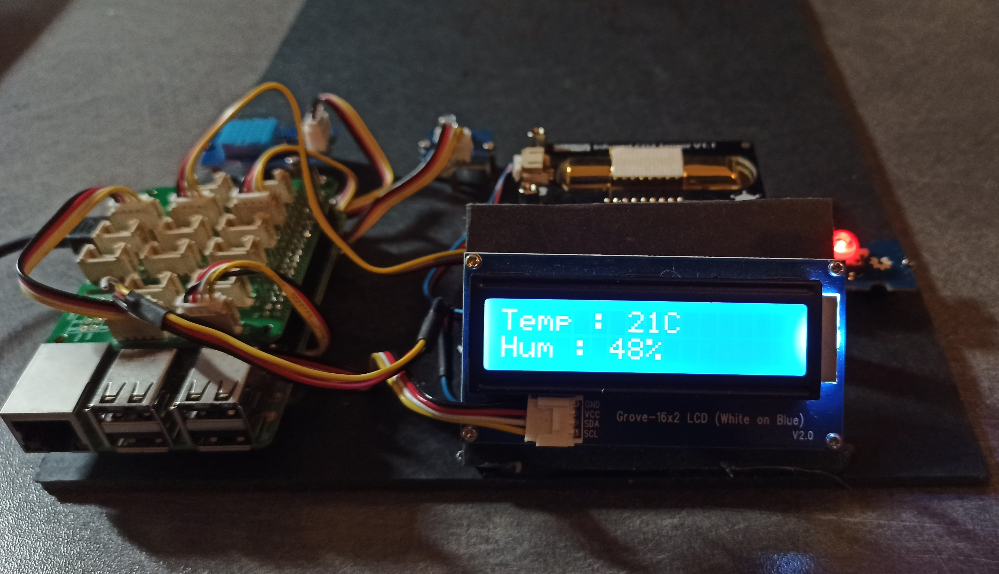

# Bienvenu dans le projet de station de qualité de l'aire

Dans cette documentation vous trouverez tout les liens vers le code et la documentation pour répliqué ce dispositif.

Lien vers la documentation : [lien](https://station-airquality.readthedocs.io/fr/latest/)

## Contexte

Il ne sagit pas réelement d'un projet a proprement parlé mais plus d'une preuve de concepte. 

Ce dispositif à pour objectif d'analyser en trotre la qualité de l'aire puis de l'afficher sur un écran disposible directement sur la sation et de l'envoyer en ligne de pourvoir crée des alertes et survelliez un environement à distance.

Cette station mesure les données suivantes :

* La température
* L'humidité
* Le nivau CO2
* Le niveau de luminosité 

Matériel utilisé :
* Une carte ``RaspberriPi 4``.
* Un carte de température et d'humidité ``DHT11``.
* Un shield pour capteur grove.
* Un afficheur LCD grove.
* Un boutton grove.
* Un capteur de luminosité grove.
* Un capteur de CO2 ``SEN0219``.
