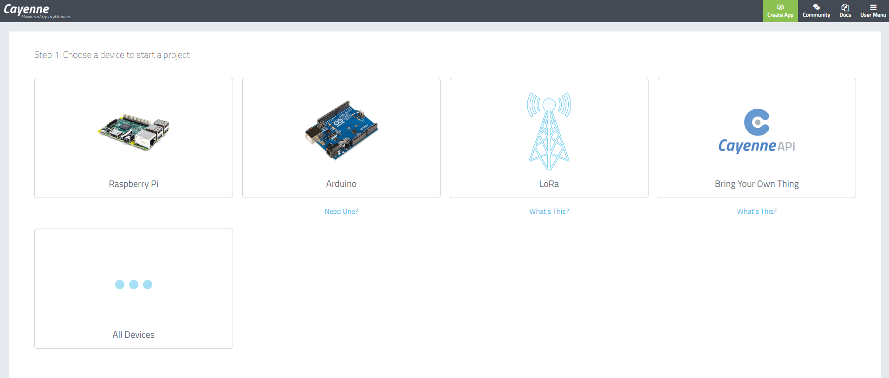
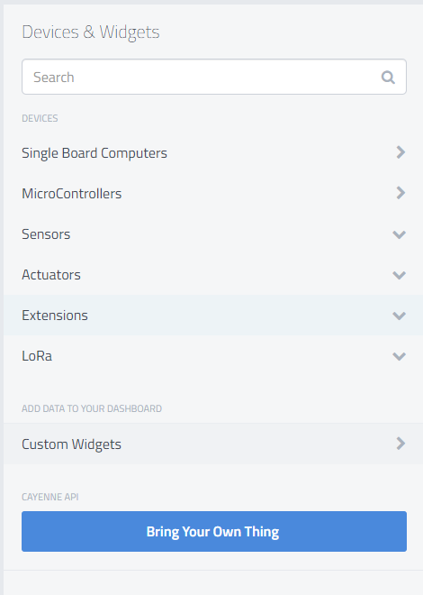
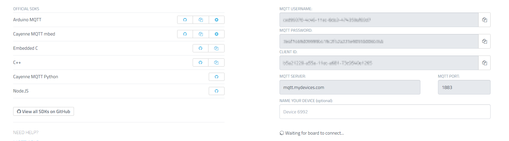
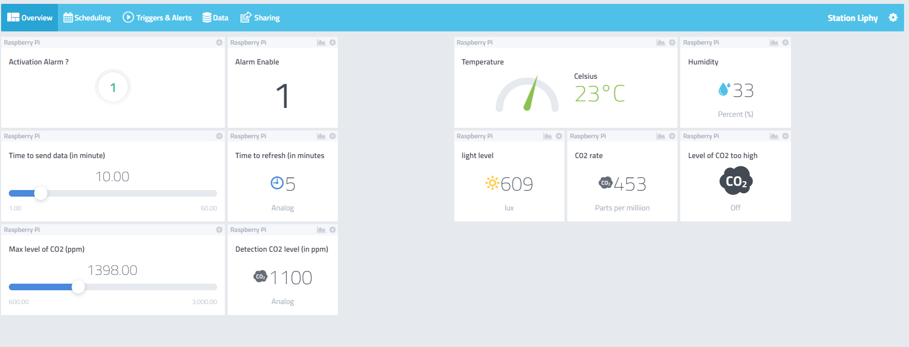

# Creation d'un dispositif Cayenne

Pour visualiser les données j'utilise un dashboard en ligne : [Cayenne myDevices](https://accounts.mydevices.com/).

1. Creez un compte
2. Sur la 1er page choisissez ``ALL Device``.

3. Ensuite cliquez sur ``Bring Your Own Thing``.

4. Ensuite vous serez sur une page qui attend la connexion avec votre appareil. Pour cela récupérez les données ``MQTT USERNAME``, ``MQTT PASSWORD`` et ``CLIENT ID`` pour les inscrire dans le programme **main.py**.

5. Une fois connecté vous allez voir apparaitre plein d'icones qui correspondent au données envoyés par la raspberry pi. Pour la suite je vous laisse appprendre par vous même comment faire un dashboard.

