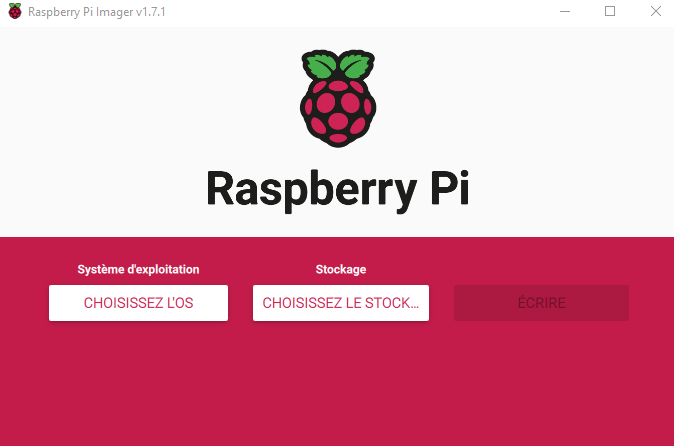
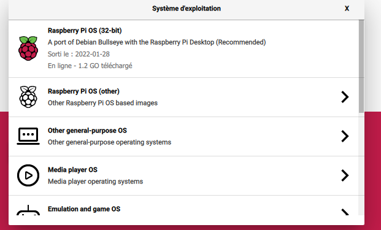
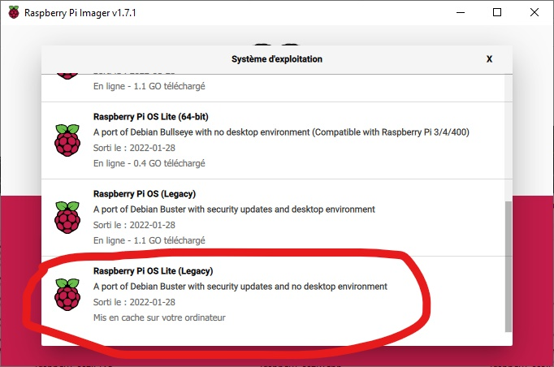

# Instalation personalisé

## Création de la carte SD

Dans cette partie, nous allons voir comment installer l'ensemble des libraire une a une.

Pour commencer il faut téléchager [Raspberry Pi OS](https://downloads.raspberrypi.org/imager/imager_latest.exe) et l'installer, cette outils permets de flasher directement une image compatible raspberrypi sans avoir a la téléchager au préalable.

Bien ententu il est possible de la télachager manuellement et de l'installer avec le [tutoriel](Configuration_flash.md).

Pour installer l'image avec Raspberry Pi OS il faut :

1. Telecharger, installer et ouvrir l'apllication.



2. cliquez sur ``CHOISISSER L'OS``, slectionnez ``Raspberry PI OS (other)``.



3. Ensuite desender tout en bas et cliquer sur ``Raspberry PI OS Lite (legacy)``.



!!! Note
    Vous aurez remarquer que nous ne prennons pas la derniers version de l'OS **Bullseye** mais la version précédante **Buster**. C'est par ce que à l'heure actuelle certaines librairies utilisées par le projet ne son pas compatible avec cette nouvelle version.

A présent vous avec une carte SD avec un logicel compatible, pour commencer le démarage brancher un clavier, écran et inserez la carte SD dans la raspberry pi.

Une fois ces étapes effectuer connecter l'alimentation. La raspberry va démarrer, attendez un peu jusqu'a ce quelle vous demande le nom dutilisateur.

Par defaut les identifiants sont :

* username = "pi"

* password = "raspberry"

!!! Note
    Attention, par default le clavier est en qwerty, le mots de passe deviens alors "rqspberry" sur un clavier azerty.


## Configuration des données par default

Afin de rendre votre raspberry utilisable, un certain nombre de chose sont a faire au 1er démarage.

1. Configuration du claviers en Azerty:
    
    * Taper la commande suivante pour entrez dans les paramètres :

            sudo raspi-config

    * Choix 5 ``Localisation Options`` -> choix L3 ``Keyboard`` -> ``PC générique 105 touches (internat.)`` -> ``autre`` -> ``Francais`` -> ``Francais`` -> ``Disposition par défault ...`` -> ``Pas de touche "compose"``.

2. Réglage de la time zone : 

    * Taper la commande suivante pour entrez dans les paramètres :

            sudo raspi-config

    * Choix 5 ``Localisation Options`` -> choix L2 ``Timezone`` -> ``Europe`` -> ``Paris``.

3. Réglage des paramètre wifi : 

    * Taper la commande suivante pour entrez dans les paramètres :

            sudo raspi-config

    * Choix 5 ``Localisation Options`` -> choix L4 ``WLAN Country`` -> ``FR``.

4. Activation du ssh pour vous connecter à distance et faire des modification sans avoir à brancher un claviers et un écran à la raspberry.
    
    * Taper la commande suivante pour entrez dans les paramètres :

            sudo raspi-config
    
    * Choix 3 ``Interface Option`` -> choix I2 ``SSH`` -> ``enable``. 

!!! Note 
    Utiliser les fléches pour vous déplacer dans le "raspi-config" et la touche **Entrer** pour valider.

## Connection à distance

Une fois que vous aurez connecter la raspberry pi (voir section [connexion](utilisation_connexion.md)). Vous pourrez vous connecter à elle à l'aide d'un simple terminale. Mais avant vous devrais connaitre sont **ip**. Pour cela vous pouvez effectuer un scan réseau (logicel : [Scanner](https://angryip.org/download/#windows)) ou en tapant la ligne suivante sur votre raspberry.

    ifconfig -a

Regarder l'ip dans la section **eth0** pour une connection filaire et dans **wlan0** pour une connection wifi.

Une fois que vous avec l'ip de votre rasberry, aller sur un ordinateur connecter au même résau que la carte puis ouvrer une terniale (**cmd** pour windows).

    ssh pi@ip
Remplacer ip par l'ip de votre raspberry (ex: 192.168.1.4).Puis entrez le même nom d'ulisateur et mots de passe qu'utiliser précédemment.

### Mettre a jour la raspberry

Voici les commandes pour mettre a jour la raspberry :
```sh
sudo apt update
sudo apt upgrade
```
## Installation d'un environement de travail

1. Installer git

        sudo apt install git

2. Crée votre dossier git 

        mkdir mon_dossier
        cd mon_dossier
        git init

3. Ajouter vos information personelle 


        git config --global user.name "Mathis"                     #to set your name
        git config --global user.email "mathis.....@gmail.com"     #to set your email adresse
        git config --global credential.helper store                #to save your password

4. Cree une branche
    
        git checkout -b main

5. Ajout le repertoire du projet 
       
        git remote add Nom_de_ma_remote https://github.com/ExpertVelouze57/Station_AirQuality.git
        git pull Nom_de_ma_remote main

## Instalation des librairies pour les capteurs

L'ensemble des capteurs que nous utilisons son des capteur grove avec une librairie très bien pour les contolers

Cependant avant il faut installer python et l'utilitaire pip.

        sudo apt install python3
        sudo apt install python3-pip

Puis les dépendances pour grove :

        echo "deb https://seeed-studio.github.io/pi_repo/ stretch main" | sudo tee /etc/apt/sources.list.d/seeed.list

        curl https://seeed-studio.github.io/pi_repo/public.key | sudo apt-key add -

        sudo apt install python3-mraa python3-upm
        sudo apt install python-rpi.gpio python3-rpi.gpio
        sudo pip3 install rpi_ws281x

Enfin installation de grove :

        sudo pip3 install grove.py

!!! Warning
    Avant de comencer il faut activer l'ic2 sur la raspberry en allant des ``raspi-config`` puis dans ``interface option`` puis dans ``I2C`` et enfin cliquez sur ``YES``.

!!! Note
    Une fois l'installation faite dans le dossier de votre git ce trouve un dossier **example** qui contient des programme python permettant de tester chacune des composantes utiliser dans le programme.

La derniers installation à faire est pour la communication mqtt pour cela nous allons installer.

        sudo pip install paho-mqtt
        sudo pip3 install cayenne-mqtt

## Démarer vos script à chaque démarage de la PI

Le programme de la station ce trouve dans votre dossier et c'est le fichier **main.py**. 

Pour que le programme démmare à chaque fois que l'on alume la raspberry il faut lui dire. Pour faire ceci il y a plusieur méthode voici celle que j'ai choisie. 

1. Modifier le fichier rc.local

        sudo nano /etc/rc.local
        
2. Ajoutez à la fin du fichier 

        python3 /home/pi/mon_dossier/main.py
        

