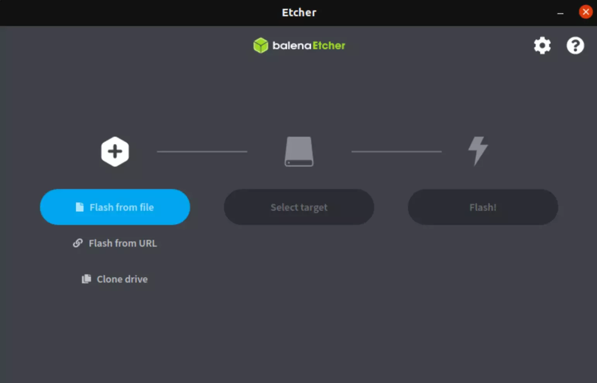
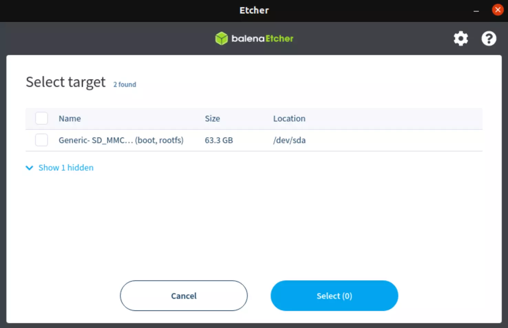

# Flasher une image

Quelque soit la méthode d'installation utilisée vous aller forcement devoir flasher une carte SD avec une image pour faire fonctionner votre RaspberryPi. Cette section vous montrera comment faire.

!!! Note
    L'ensemble des données de la carte SD vont etre suprimer. Faites en sorte qu'il n'y en ai pas.

1. Pour commencer il faut téléchager le logiciel [BalenaEtcher](https://www.balena.io/etcher/).

2. Inserez la carte SD dans votre ordinateur.

3. Ensuite démarer le logiciel et selectionner l'image que vous voulez flasher sur la carte SD (Voir les sections précédante pour le choix de l'image [basic](Configuration_facile.md) ou [custom](Configuration_custom.md) ). Pour cela cliquez sur ``flash from file``.

4. Selectionez la carte SD que vous venez d'inserer, en vérifiant que c'est bien la bonne en regardant la taille de celle ci par example. Pour selection la carte cliquez sur ``Select target`` -> cocher le bon périphérique -> cliquez sur ``Select``.

5. Pour finir cliquer sur ``Flash!`` et patientez un petit moments.

!!! Warning
    Penser à ejecter votre carte SD avant de la retirer de l'orinateur sinon vous riquez de l'endomager.
