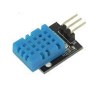
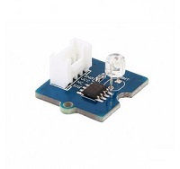
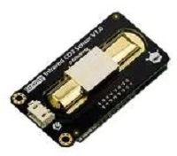
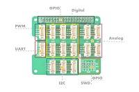

# Capteurs

## Capteur DHT11

* Alimentation: 3 à 5 Vcc
* Consommation maxi: 2,5 mA
* Plage de mesure:
    - température: 0 à +50 °C
    - humidité: 20 à 100 % HR
* Précision:
   - température: ± 2 °C
   - humidité: ± 5 % HR
Dimensions: 16 x 12 x 7 mm

## Capteur de lumière (Grove V1.2)

* Alimentation: 3,3 à 5 Vcc
* Consommation: 0,5 à 3 mA
* Temps de réponse: 20 à 30 ms
* Longueur d'onde: 540 nm
* Dimensions: 20 x 20 mm

## Capteur de CO2 (SEN0219)

* Alimentation: 4,5 à 5,5 Vcc
* Consommation: 85 mA maxi
​* Sortie analogique: 0,4 à 2 Vcc
* Plage de mesure: 0 à 5000 parties par million (PPM)
* Précision: ± (50  PPM + 3%)
* Temps de préchauffage: 3 min
* Temps de réponse: 120 s
* Température de service: 0 à 50°C
* Humidité de service: 0% à 95% HR
* Dimensions: 37 x 69 mm
* Poids: 34 g

Formule de calcule entre la valeur analogique et les ppm.

        real_value = (sensorValue*(5000/1024.0) - 400) x 50.0 /16.0 

## Shield grove

* Caractéristiques :
    
   * ADC 12-bit
   * Compatibilité: Raspberry Pi 3B+, 4B, Zero et Zero WH
   * Interface SWD
   * Dimensions: 65 x 56 x 19 mm

* Connectiques :

   * 1 port PWM
   * 1 port UART
   * 4 ports analogiques
   * 6 ports GPOI
   * 3 ports I2C