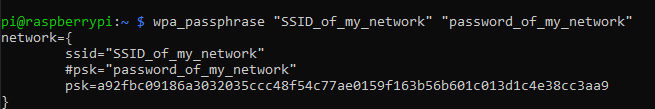
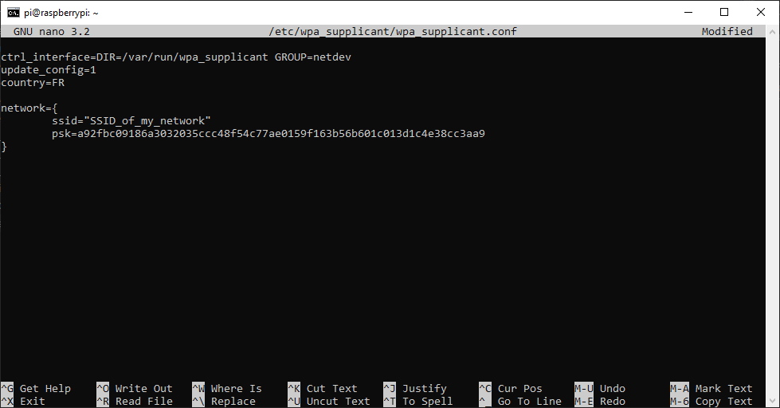
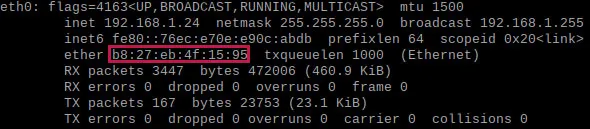
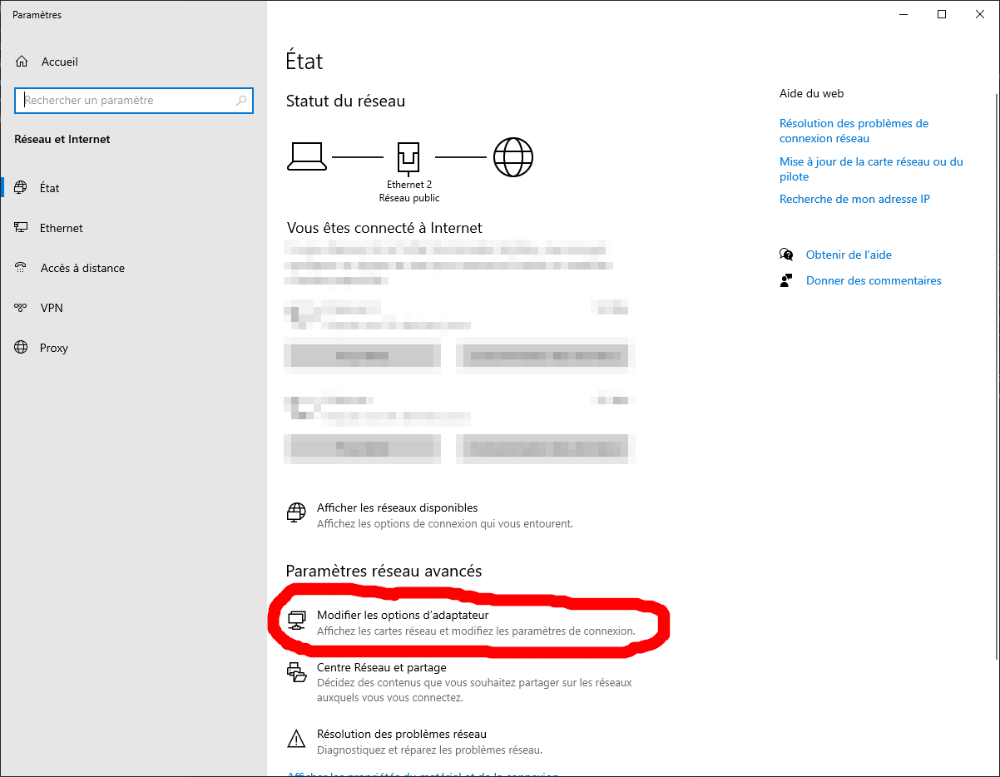
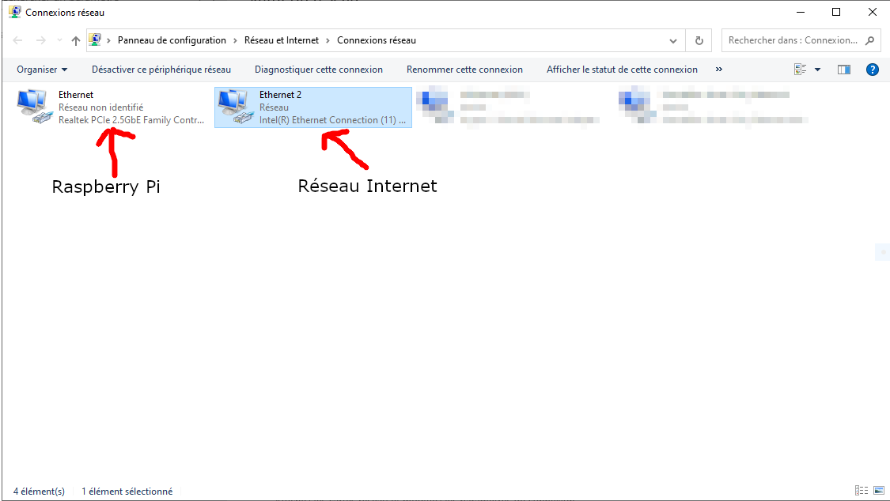
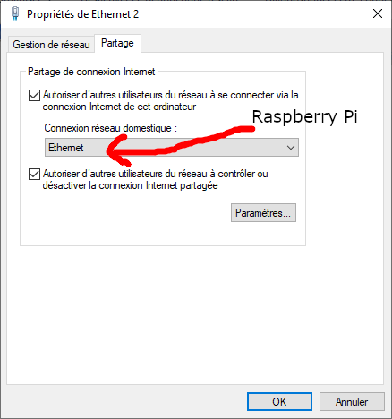

# Connexion à internet

### Connexion Wifi

Pour vous connecter en wifi il faut soit que votre raspberry soit connectée a votre ordinateur (suivre les section précédante) (en directe ou sur le même réseau) soit que vous y accédier directement avec un clavier et un écran.

1. Connectez vous au terminale de la raspberry pi (ssh ou avec le clavier).

2. Generer une le texte de votre réseau avec la commande suivante et copier le :

        wpa_passphrase "SSID" "PASSWORD"

    

!!! Note 
    Utiliser cette fonction pour éviter que votre mots de passe ce retourve en claire dans le fichiers de configuration du wifi. 

3. Ouvrir le fichier de configuration du wifi avec les accès administrateur :

        sudo nano /etc/wpa_supplicant/wpa_supplicant.conf

4.  Pour finir ajoutez à la fin du fichier le texte précédament copié en suprimant la ligne avec votre mot de passe en claire.

  

5. Recharger la configuration pour que le raspberry prenne en compte les modification.

        sudo wpa_cli -i wlan0 reconfigure 

### Connection Ethernet 

Normalement il suffit de connecter un cable réseau à la raspberry pi pour quelle soit connectée à internet. Cepedant certaint résau priver block les connexion ous permise. si c'est le cas raprocher vous de votre administrateur résau et donnéer lui l'adresse **MAC** de votre raspberry pour qu'il l'autorise.

Voici comment obtenir cette adresse : 

Tapez la commande suivante
        
        ifconfig

Dans la section ``eth0`` vous trouverai un numero precédé de ``ether``, il s'agit de l'adresse mac.

Si vous souhaiter juste connecter votre raspberi pi a votre orfinateur pour faire des modification (ex ajout d'une connection wifi) ou si vous souhaiter transferer la connexion internet de votre ordinateur vers la carte raspberry pi voici la marche à suivre.

1. Allers dans les parametres résau, clique droit sur l'icon puis ``Ouvrir les paramètres réseau et internet``.

2. Sur la nouvelle fenêtre cliquez sur ``Modifier les options d'adaptateur``.

3. Dans cette fenêtre, on peut voire toutes les connexions de notre ordinateur. Dans mon cas la connexion ``Ethernet 2`` corespond à mon réseau (Box internet) et ``Ethernet`` corespond à la raspberry. Il faut donc transférer la connexion de ``Ethernet 2`` vers ``Ethernet``. 

4. Pour cela faire clique droit sur ``Ethernet 2`` -> ``Propriétés``. Dans l'onglet ``Partage`` cochez les 2 cases et selectionnez à l'aide du menu déroulant le réseau de la raspberry.

