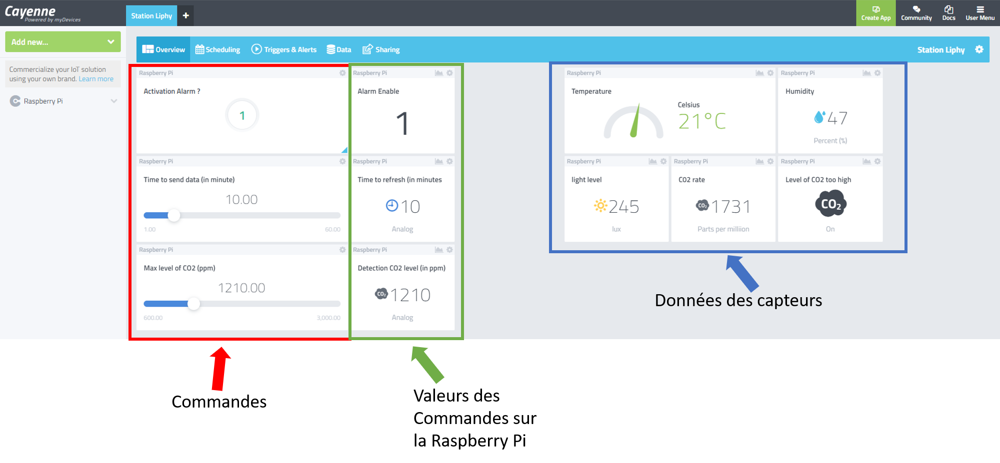
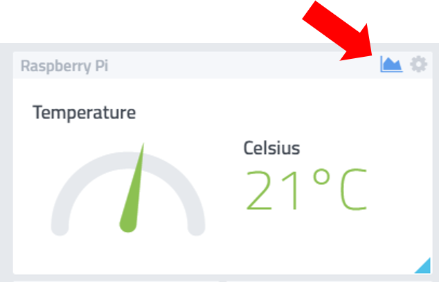
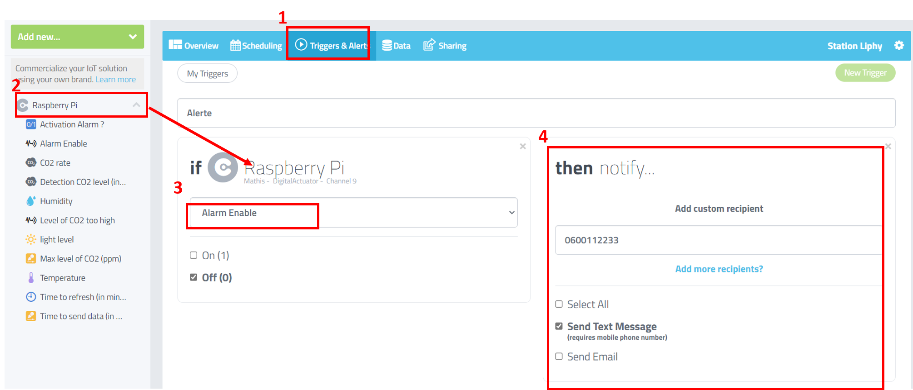

# Le Dashboard

Une fois connectez à cayenne, il faut allez sur la dasboard en cliquant sur le projet ``Station Liphy`` en haut à gauche de la page.

### Envoyer des commandes

Pour envoyers des commandes il faut que l'appareil soit en mode réception ([tuto](utilisation_materiel.md#réception-de-commande))

On manipule ensuite les commandes avec la partie rouge puis la partie verte va se mettre à jour.

!!! Note 
    Les valeurs des commandes sont celle qui sont en verte la partie rouge est la que pour controler ces valeurs ne font pas foi.

### Afficher un graphique

On peut afficher un graphique sur chaque données afin de voir son évolution dans le temps pour cela il faut aller sur la donnée qui nous interaisse et cliquez sur l'icone graphique.

### Placer une alerte

Il est possible de placer une alerte sur nirmporte quelle signal. Cette alerte pourra nous envoyer un mail et/ou un sms si le niveau de CO2 est trop élevé par example.

Pour cela il suffit d'aller dans la section ``Triggers & Alerts`` (1), puis de selctionnez le device ``Raspberry Pi`` (2), selectionnez la valeurs à surveillez (3) et le mode de notification.  

