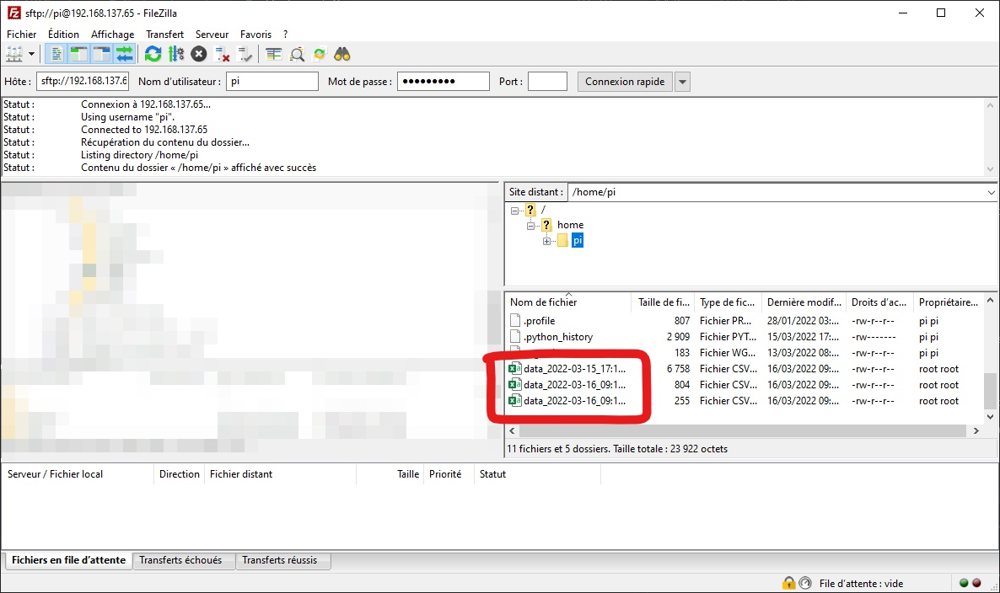

# Le Materiel

Une fois brancher, la carte va collecter, envoyer et afficher les données.

### Ecran basique

Par default l'écran va afficher les données de température et d'humidité puis 5s plus tard celle de luminosité et de CO2 ainsi de suite.

Le 1er écran :

Le 2ème écran :

### Afficher les IPs

A l'aide de l'écran il est aussi possible d'affichers l'adresse ip de la raspberry. Pour cela il suffit d'apuyer 1 fois sur le bouton rouge.

L'écran afficherage donc l'adresse ip de la raspberry pi. Celle du haut correspond a sont adresse ip sur le réseau filaire et celle du bas a son adresse sur le reseau wifi.

Pour revenir au mode normale il suffit de rappuyer 1 fois sur le bouton.

### Réception de commande

L'appareil peut recevoir des commandes depuis cayenne, cependant pour éviter les malversations une modification présentielle est necessaire. Pour mettre le système en mode reception appuez rappident 2 fois sur le bouton.

Celui-ci va se mettre à clignoter et l'écran va changer.

Une fois toutes les commandes transmises, il faut faire repassé le programme en cycle normale. Pour cela maintenez le bouton enfoncé jusqu'a ce qu'il setteigne. L'affichage repassera alors dans le mode par défault.

## Recuperer les données 

Si besoin les données sont enregistrer au format csv sur la carte. Pour les récuperer vous pouvez utiliser le logiciel [FileZilla](https://filezilla-project.org/download.php).

1. Connectez vous à la raspberry pi à l'aide de FileZilla. Dans le partie de droite ces les données de la raspberry pi et dans la gauche celles votre ordinateur.

2. Selectionnez les fichiers voulu sur la raspberri pi et déposaient les sur votre ordinateur. 

